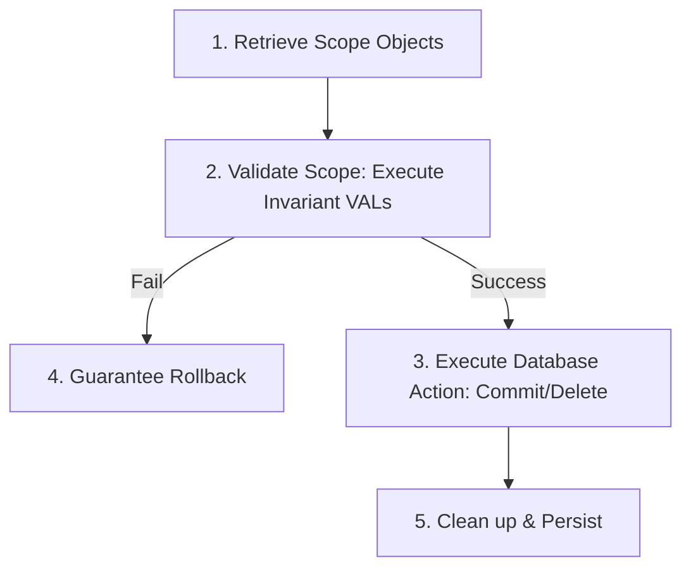

# Data Quality & ACID Principles

While the Mendix platform handles Isolation (I) and Durability (D) out of the box, developers are responsible for implementing **Atomicity (A)** and **Consistency (C)**. The Menditect Testability Framework establishes strict patterns to safeguard these transactional guarantees.

---

## 1. Atomicity: The Transactional Scope

Atomicity guarantees that database modifications are **"all or nothing."** All object creations, modifications, and deletions within a transaction must succeed together, or all must be rolled back.

To manage this, we use the concept of a **Scope**—a collection of all mutated objects (creations, changes, or deletions) in a single business transaction that must be treated as a single unit. Special care should be taken when objects are associated via a 1:1 association, because mutating one side of the association is also changing the other side as well. In that case, both objects should be placed on the scope.

### 1.1 Transactional Scope Patterns

To implement reliable Atomicity, you must create a clear, defined scope that collects all manipulated objects. There are three primary design patterns found in enterprise Mendix projects to structure and manage the transactional scope:

1. **List-Based Scope**:
   The scope consists of **Microflow Variables** that hold lists of changed objects. These lists are passed through the microflow hierarchy and committed together at the end of the transaction.
   *   **Scope Creation**:
       1.  **Touchpoint Microflows**: For objects created or changed directly by user input, the Touchpoint initializes an empty list and adds the mutated object.
       2.  **Top Orchestration Microflows**: For objects modified later by internal logic (e.g., in `OPR_` or `CON_` layers), the Top Orchestration initializes empty list variables.
       *   The combination of these lists forms the complete transactional scope.
   *   **Preventing Duplicate Objects**: If an object is updated and added to a list multiple times, the list will contain duplicate references, causing inconsistent commits.
       *   *Solution*: Implement a dedicated `add to scope` helper microflow for each entity that removes any previous instance of that object from the list before adding the updated version.
   *   **Naming Convention**: Always prefix or suffix scope parameters with a distinct name like `<entityname>_toCommit` or `<entityname>_toDelete` to distinguish them from standard parameters.
   *   **Processing Options**:
       *   **Option A (Separate Lists)**: Maintain distinct parameter lists for objects to be committed vs. deleted.
       *   **Option B (Single List)**: Use one consolidated list, but add a `MutationType` attribute (Boolean or Enumeration) to the objects to indicate whether to Create, Update, or Delete.

2. **Main Object Scope**:
   The scope is implicit. Instead of using separate list variables or helper objects, one of the **main transaction objects** itself is treated as the transactional root. The scope is dynamically constructed by the final commit step (`CMT_`) by retrieving all mutated objects that are associated with this main object.

3. **Helper Object Scope (NPE Root)**:
   This pattern uses a special **Non-Persistent Entity (NPE)** to act as the **transactional root**. This helper object links to all the other changed objects. It travels through the microflow chain, and when the final commit microflow executes, it uses the helper object to retrieve and save all associated objects together as one unit. This scope type is the official pattern used by Menditect.

### 1.2 Targeted Rollbacks
When a business validation fails, only "non-touchpoint" changes (the lists created by the Top Orchestrations) should be rolled back.
*   **Preserve Touchpoint Changes**: Mutated objects representing direct user input (on the list initialized by the Touchpoint) must be preserved in memory (not rolled back) to ensure that the user's initial screen inputs are not lost on failure.

---

## 2. Consistency: Invariant vs. Variant Rules

Consistency ensures that every transaction successfully moves the system from one valid state to another valid state. We categorize business validations into two types:

### 2.1 Invariant Validations (Data Integrity)
*   **Definition**: Rules that must *always* hold true, regardless of context or time (e.g., `Order_Amount` must be $\ge$ €100).
*   **Implementation**: Done via Validation (`VAL_`) unit microflows.
*   **Enforcement**: Must be executed by the Committer (`CMT_`) right before committing objects to the database. Even if called early in touchpoints for UI feedback, the CMT remains the authoritative gatekeeper.

### 2.2 Variant Validations (Process Validation)
*   **Definition**: Context-dependent rules that confirm an action is valid *at the moment of execution* (e.g., "The customer must have a valid credit card *when placing an order*").
*   **Implementation**: Evaluated inside Orchestration (`ORC_`) flows using standard decision activities or Rule (`RULE_`) microflows.

---

## 3. Why Error Handlers Fail as Data Integrity Tools

Developers sometimes attempt to use Mendix Error Handlers around database commit actions to catch validation failures and handle rollbacks. **This is a severe architectural anti-pattern.**

Standard error handling mechanisms prove inadequate for data validation due to two fundamental conflicts:

1.  **Feedback Suppression (Native Rollback)**: Re-throwing an error via an Error Event successfully rolls back the database and memory context. However, it blinds the user by suppressing "pink" field highlighting and helpful error messages, replacing them with a generic, unhelpful system exception.
2.  **State Synchronization (Dirty/Destroyed State)**: Catching an error with standard End Events or Custom without Rollback preserves the UI but forces synchronization of dirty states to the Client Cache, contaminating the browser. Furthermore, if manual rollback actions are applied, any uncommitted objects are destroyed in memory, rendering the UI unresponsive.

> [!IMPORTANT]
> **Conclusion**: Error handlers are a technical safety net for technical recovery, NOT a business validation tool.
>
> To achieve data integrity without sacrificing user experience, you must isolate validation from the transaction commit cycle. Always execute server-side validations (`VAL_`) within the Committer (`CMT_`) *before* triggering any Mendix database commit actions.

---

## 4. Committer Pattern (CMT)

The Committer (`CMT`) microflow typology is the **single point of database interaction** for saving or deleting objects.

### Standard CMT Execution Sequence
A standard Committer pattern must strictly execute these five steps in order:

1.  **Retrieve Scope Objects**: Collect all mutated objects belonging to the transaction scope (relevant for Main Object and Helper NPE scopes).
2.  **Validate Scope**: Invoke all relevant Invariant Validation (`VAL_`) microflows.
3.  **Execute Database Action**: Perform the native Mendix Commit or Delete actions on the scope objects.
4.  **Guarantee Rollback**: If validation fails or the database action encounters an error, rollback all objects that are not directly manipulated by the UI page parameter to revert changes in memory.
5.  **Persist & Cleanup**: Finalize any post-transaction requirements and delete/clean up any Non-Persistent Helper Objects.

---

## 5. Event Handlers: Unsuitable for Data Integrity

Before-Commit (`BC`) event handlers trigger immediately before an object is committed to the **Database Transaction Buffer**. While this makes them a "last line of defense" for specific technical requirements, such as enforcing object uniqueness (e.g., ensuring a System ID is unique across the entire database), they are not a suitable mechanism for full data-integrity purposes.

### 5.1 The Risk of "Silent Failure"
A significant risk in event-driven logic is the interpretation of the Boolean return value of an event handler. If a Before-Commit microflow returns `false` without the "Raise an error" flag being explicitly set, the Mendix Runtime cancels the commit *for that specific object only*.

This behavior creates a critical state divergence: the calling microflow proceeds as if the persistence succeeded, while the database remains in its previous state. While this can be mitigated by ensuring the "Raise error" flag is always checked, the potential for human error makes it an unreliable foundation for data integrity compared to service-level validation where failures are explicit and blocking by default.

### 5.2 Absence of User Feedback and "Pink Field" Support
Even when the Event Handler is configured to raise an exception, it lacks the necessary communication channel to the User Interface:
*   **Validation Feedback Suppression**: Event Handlers cannot trigger native "Validation Feedback" actions (the pink highlights under input fields).
*   **Context Loss**: If configured to "Raise an error," the user is met with a generic system exception. The transaction rolls back to ensure integrity, but the user is left with no clue which field failed or why, often losing all their session data in the process.

Using triggers in this way does not simplify the architecture; it merely shifts the burden of error handling and rollback management elsewhere in the stack.

### 5.3 Failure of Atomic Batch Validation
The most critical limitation regarding Atomicity is that Before-Commit triggers fire on an object-by-object basis, not at the transaction level. This architecture makes it impossible to validate a collection of various objects as a single, cohesive unit:
*   **Incomplete Transactions**: If a validation failure occurs on the final object in a set, the preceding objects may have already been sitting in the Database Transaction Buffer. While a raised error may trigger a rollback, the validation logic itself was executed in isolation for each object.
*   **Lack of Context**: A trigger on "Object A" cannot inherently "see" the state of "Object B" in the same commit batch. True data integrity requires the entire Microflow Context to be validated as one unit before *any* data is sent to the buffer. Because triggers cannot enforce this "all-or-nothing" rule across different entities, they cannot guarantee a clean transition from one consistent database state to another.

### 5.4 Best Practices for Event Handlers

To avoid these architectural vulnerabilities, follow these strict rules for Mendix Event Handlers:

> [!IMPORTANT]
> **The Event Handler Rule**:
> *   **Use Event Handlers ONLY for Data Augmentation**: They are ideal for "side-effect" logic that does not require user intervention, such as timestamps or audit logging. In these cases, the microflow should **always return `true`** to avoid silent failures.
> *   **Never Use Event Handlers for Data Validation**: Business rules and integrity checks must be handled within the Microflow Context (via standard server-side `VAL_` microflows executed inside the `CMT_` pattern) prior to any commit actions. This ensures full control over user feedback and transaction atomicity.
