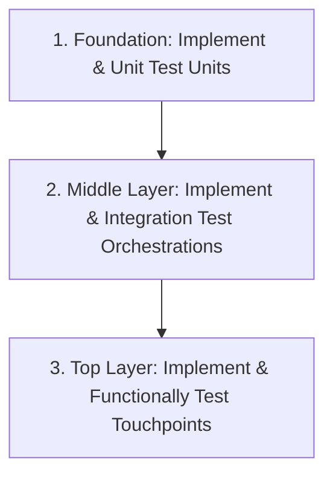

# Practical Workflow for Testable Development

This guide outlines the step-by-step workflow for implementing Mendix logic under the Testability Framework. Rather than designing everything upfront, a testable design is allowed to emerge iteratively by writing test cases early and building outward from the most independent pieces of logic.

---

## 1. Start with "Wishful Thinking"
Before writing any implementation microflows, follow Kent Beck's test-driven rule of thumb: **"Write a test that describes your ideal Object API."**

*   **The Mindset**: Imagine the component you need already exists in its perfect form. Write a test case specifying how you would ideally interact with its interfaces.
*   **The Benefit**: This process forces you to define clear, public interfaces and explicitly identify necessary input dependencies, preventing tight coupling and ad-hoc designs.

---

## 2. Step-by-Step implementation Sequence
This workflow aligns directly with the Software Testing Pyramid, building from the foundation (the most independent units) up to the top layers.

### Step 1: Foundation (Build and Test Units First)
Begin with the smallest, most independent pieces of logic: Unit microflows (`OPR`, `VAL`, `GET`, `RULE`, `FTN`).
*   **Why**: These microflows have no dependencies on other business microflows. They are the easiest to test because their behavior is entirely deterministic, depending solely on input parameters.
*   **Action**:
    1.  Define the Unit's preconditions and expected postconditions.
    2.  Write unit tests verifying boundary values and extreme edge cases.
    3.  Ensure the Unit is rock-solid before moving up.

> [!TIP]
> **Design with Return Values**: Always ensure your Unit microflows return a value (e.g., the mutated object, the calculated decimal, or a validation boolean). This allows unit tests to assert directly on the returned outcome using `Assert Microflow Return Value` instead of needing to retrieve database state to verify the result.

### Step 2: Middle Layer (Integrate and Test Orchestrations Next)
Once the underlying Units are verified, implement and test the logic that composes them: Orchestration microflows (`ORC`).
*   **Why**: An Orchestration is a class that depends on Units you have already proven to be correct. Therefore, your integration tests do not need to re-verify detailed Unit outputs.
*   **Action**:
    1.  Create an Integration Test focusing solely on the *execution path* (control flow).
    2.  Use the **TestLogger** helper component to assert that the sequence of called Unit microflows (the "execution footprint") matches the correct baseline sequence for a given set of inputs.

### Step 3: Top Layer (Validate End-to-End Functional Behavior Last)
Finally, address the public entry points of your application: Touchpoint microflows (`ACT`, `PUB`, `SCE`).
*   **Why**: Because you have already thoroughly tested the Units and their Orchestration pathways, high-level functional tests can remain minimal and highly targeted.
*   **Action**:
    1.  Write a lean functional test executing the Touchpoint (e.g., clicking a button triggering `ACT_order_save`).
    2.  Verify only the high-level business outcome (e.g., "The order state transitions to Active") and that appropriate user feedback (messages, page refreshes) is displayed.

> [!TIP]
> **Leverage Touchpoint Output**: Design Touchpoint microflows (especially `ACT_`) to return the primary object created, modified, or retrieved. In MTA, this returned object can be automatically captured as a step output and passed directly as input to subsequent Change Object or Microflow Parameter steps, eliminating redundant retrieve steps.

