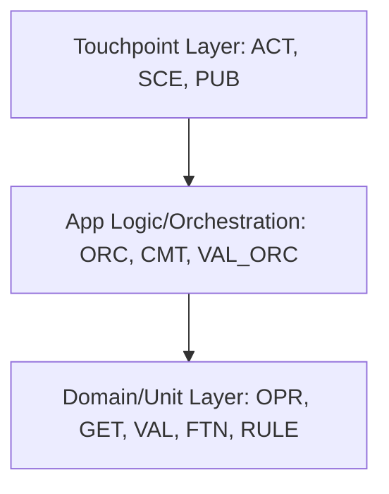

# Microflow Typologies

A microflow typology is a standardized pattern of a microflow designed for a specific, single purpose. Standardizing typologies clarifies responsibilities, simplifies code, establishes visual patterns, and directly links microflows to the Testing Pyramid.

---

## The Three Main Categories

Mendix microflows are classified into three core categories: **Touchpoints**, **Orchestrations**, and **Units**.

### 1. Touchpoint Typology
*   **Purpose**: Catches external triggers (UI, APIs, timers) and routes them to App Logic.
*   **Key Responsibility**: Handles triggers, invokes orchestrations, manages client navigation (open/close pages), and refreshes the Client Cache (Browser).
*   **Base Types**:
    *   **Action (`ACT`)**: Handles user interactions on pages (button clicks, data sources, page events).
    *   **Scheduled Event (`SCE`)**: Triggered by a background cron job / timer.
    *   **Published API (`PUB`)**: Handles incoming REST, ODATA, or SOAP requests.
*   **Core Pattern**:
    1.  Check preconditions (e.g., check if the event should run).
    2.  Invoke Orchestrations (`ORC_`) or Units (`GET_`/`VAL_`).
    3.  Call commit logic (`CMT_`) if necessary.
    4.  Determine next navigation step and refresh page parameters (UI only).

> [!WARNING]
> **Client Cache Synchronization**: The synchronization of the widget state on a page with data from the Client Cache depends on Mendix refresh mechanisms. To ensure a predictable, clean update, **always let the Touchpoint microflow refresh the page parameter objects**. For performance reasons, this refresh action must *never* be implemented in Orchestration or Unit microflow typologies.

> [!TIP]
> **Return Values for Testability**: Touchpoint microflows (such as `ACT_`) benefit significantly from returning the primary object created, modified, or retrieved. Returning an object allows MTA tests to capture it as a step output and pipe it as input to subsequent change, delete, or microflow parameter steps without performing redundant database retrieves.

### 2. Orchestration Typology
*   **Purpose**: Coordinates business processes by composing Units and other Orchestrations.
*   **Key Responsibility**: Controls the flow of execution and decision branching. It must **never** create or modify attribute/object values directly—it delegates all mutations, calculations, and validations to specialized Unit microflows.
*   **Base Types**:
    *   **Orchestration (`ORC`)**: Standard process coordinator.
    *   **Committer (`CMT`)**: Standard commit coordinator. Evaluates whether saving is allowed and commits objects.
    *   **Validation Orchestrator (`VAL_ORC`)**: Composes multiple business validations for a specific context.
*   **Core Pattern**:
    1.  Check preconditions.
    2.  Call other Orchestrations or orchestrate Unit execution.
    3.  Call Committer (`CMT_`) to save the transaction scope.

### 3. Unit Typology
*   **Purpose**: The smallest executable functionality resulting in a measurable, quantifiable output (e.g., an object/attribute change, retrieved list, or boolean result).
*   **Key Responsibility**: Performs isolated data manipulation, queries, or computations. To remain easily testable, a Unit **should not** call other business microflows (with the sole exception of nested `GET_` calling another `GET_` or `FTN_` calling another `FTN_` of the exact same typology).
*   **Sub-Groups**:
    *   **Data Units** (Allowed to mutate data in memory):
        *   **Operator (`OPR`)**: Creates, modifies, or flags objects for deletion. *(Note: physical deletion is executed by the CMT; OPR merely flags the object).*
        *   **Consumed API (`CON`)**: Executes calls to external services.
    *   **Common Units** (Strictly read-only; **not** allowed to mutate objects):
        *   **Getter (`GET`)**: Retrieves, filters, sorts, and joins data.
        *   **Function (`FTN`)**: Evaluates a literal value or manipulates list contents (no object attribute changes).
        *   **Validation (`VAL`)**: Evaluates business invariants, returning a validation message or Boolean.
        *   **Rule (`RULE`)**: Evaluates complex conditions, returning a Boolean or Enumeration.

> [!TIP]
> **Return Values for Testability**: Unit microflows (such as `FTN_`, `VAL_`, `OPR_`) should always return a value (e.g., returning the mutated object, the calculated decimal, or a validation boolean). This makes it trivial to assert on the returned outcome directly in Backend unit tests using `Assert Microflow Return Value`, verifying business invariants and logical branches reliably.

---

## Allowed Call Hierarchy

To maintain Separation of Concerns and prevent circular dependencies, a strict call hierarchy must be enforced. The table below outlines what a microflow typology is permitted to call:

| Caller Typology | Allowed to Call | Forbidden to Call |
| :--- | :--- | :--- |
| **Touchpoints** (`ACT`, `SCE`, `PUB`) | `ORC`, `CMT`, `VAL_ORC`, and any Unit (`OPR`, `GET`, `VAL`, etc.) | Other Touchpoint microflows. |
| **Orchestrations** (`ORC`) | Same typology (`ORC`), `CMT`, `VAL_ORC`, and any Unit (`OPR`, `GET`, `VAL`, etc.) | Touchpoint microflows. |
| **Committers** (`CMT`) | Same typology (`CMT`), `VAL_ORC`, and Common Units (`GET`, `VAL`, `FTN`, `RULE`) | **Data Units** (`OPR`, `CON`) — *to prevent object mutations during final commit*. |
| **Validation Orchestrations** (`VAL_ORC`) | Same typology (`VAL_ORC`), Validation Units (`VAL`) | `ORC`, `CMT`, `OPR`, `CON`, and other non-validation Units. |
| **Units** (`OPR`, `CON`, `GET`, `VAL`, `FTN`, `RULE`) | Only nested `GET_` calling another `GET_` or `FTN_` calling another `FTN_` of the exact same typology. | Any Touchpoint, Orchestration, Committer, or dissimilar Unit. |

> [!WARNING]
> **Deeply Nested Units**: Be extremely cautious when nesting Unit microflows (e.g., `GET` calling multiple `GET`s). Every nested call exponentially multiplies the number of edge cases that must be verified, making unit testing extremely difficult.

> [!TIP]
> **TestPath Probe Placement**: To keep your regression tests stable when you refactor the orchestration/process layer, always place your TestLogger probes inside **Unit microflows** (the lowest layer of data manipulation), rather than in Orchestrations.
