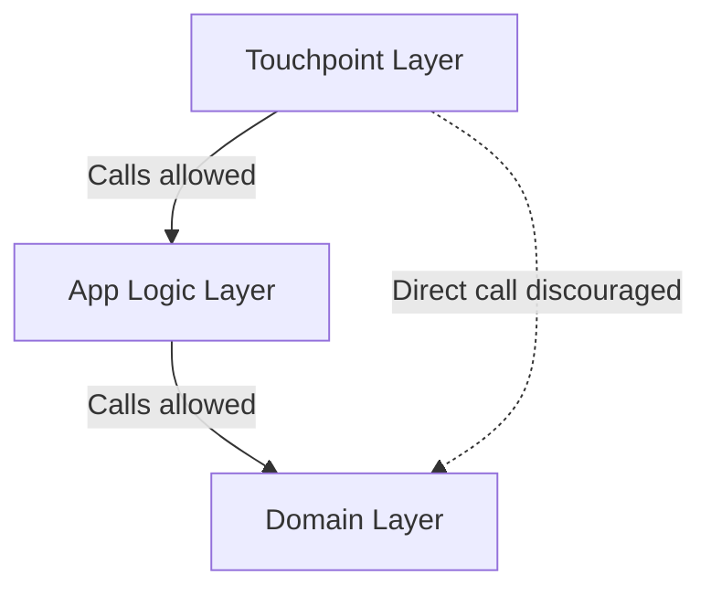

# Testable App Architecture

An application's testability is directly determined by its architecture. The Menditect Testability Framework implements two foundational design principles to achieve isolatability: **Separation of Concerns (SoC)** and **Dependency Injection (DI)**.

---

## 1. Separation of Concerns (SoC)

Separation of Concerns divides the application into distinct parts, each with a single responsibility. This is enforced horizontally, vertically, and through encapsulation.

### 1.1 Horizontal Layering
Logic is segmented into three distinct layers, establishing a strict one-way call hierarchy where higher layers call lower layers, but lower layers never call higher ones. This prevents circular dependencies.

1.  **Touchpoint Layer**: Handles external triggers (e.g., Pages, APIs, Scheduled Events). Corresponds directly with Touchpoint microflows (`ACT`, `SCE`, `PUB`).
2.  **App Logic Layer**: Orchestrates business processes and coordinates flow. Contains standard Orchestration microflows (`ORC`), Committers (`CMT`), Validation Orchestrations (`VAL_ORC`), and general functions/rules.
3.  **Domain Layer**: Encapsulates core business entities, Invariant validations (`VAL`), and state mutation logic (`OPR`). Contains Orchestrations (`ORC`) only when strictly necessary to maintain immediate data consistency (e.g., verifying unique fields).

### 1.2 Vertical Componentization
The application is partitioned vertically into functional components representing specific business capabilities (such as *Order Management*).
*   Typically implemented as separate **Mendix Modules**.
*   Each component must enforce internal horizontal layering and maintain clear boundaries.
*   **Critical Rule**: Do *not* make direct cross-module Domain Layer calls. Inter-module communication must go through public App Logic Layer (`ORC_`) interfaces. This prevents tight coupling and brittle tests.

### 1.3 Public vs. Private Encapsulation
To enforce modular boundaries:
*   **Private Microflows** (prefixed with `_`, e.g., `_ORC_calculate_tax`): Contain internal implementation details and are inaccessible from outside their layer or module. This allows internal changes without breaking external consumers.
*   **Public Microflows** (no leading `_`, e.g., `ORC_order_save`): Act as the formally exposed, stable integration entry points for a component.

---

## 2. Process Modeling Across Components

When a business process spans multiple components (modules), how you structure the execution flow is crucial for maintainability and testability.

### 2.1 Depth-First Processing
*   **Definition**: Executes a sub-microflow and all its nested calls completely, traversing top-down in a single execution thread before returning to the parent.
*   **Characteristics**: Predictable, but can lead to very deep callstacks, tightly-coupled components, and high memory consumption because all objects remain active in the single transaction context.

### 2.2 Breadth-First Processing
*   **Definition**: Divides a large process into independent, smaller sub-tasks of a certain type. Each sub-task establishes an explicit "state" (via status attributes) which subsequent tasks evaluate before executing.
    *   **Synchronous Breadth-First**: Sequential sub-tasks are executed within one microflow, proceeding to the next step only after all items of the previous step have finished.
    *   **Asynchronous Breadth-First**: Spawns independent background processes (using task queues or scheduled events) to handle sub-tasks, triggering state changes asynchronously.

> [!TIP]
> **Preferred Cross-Component Pattern**: For processes spanning multiple components, **Breadth-First Processing is superior**.
>
> It allows each component to own and manage one specific task type, reducing execution complexity, minimizing the number of active objects in memory, and enabling multi-threaded asynchronous processing. It does require tracking explicit state (status attributes) and checking preconditions on each step to ensure proper sequencing.

---

## 3. Dependency Injection (DI) in Mendix

In Mendix, Dependency Injection is applied specifically to **data** and **configuration** (since microflows themselves cannot be dynamically injected at runtime). DI makes dependencies explicit and controllable.

### 3.1 Data Injection
Instead of retrieving objects inside deeply nested business microflows:
1.  **Centralize Retrieval**: Perform all retrieve actions inside dedicated Getter microflows (`GET_`).
2.  **Pass as Parameters**: In business logic microflows (such as Operators `OPR_` or validations `VAL_`), "ask" for the required objects as input parameters instead of fetching them internally.

This removes hidden database lookups, making logic deterministic and allowing test engines to inject "test double" or mock objects in memory without setting up global database state.

### 3.2 Configuration Injection
Avoid retrieving system-wide configurations, constants, or global settings within nested microflows.
*   Retrieve configuration objects **once** at the start of a process (in a Touchpoint or high-level Orchestration).
*   Pass relevant configuration parameters down to the microflows that require them.
*   If a microflow starts to require too many parameters, group them into a single Non-Persistent Entity (NPE) configuration object.
