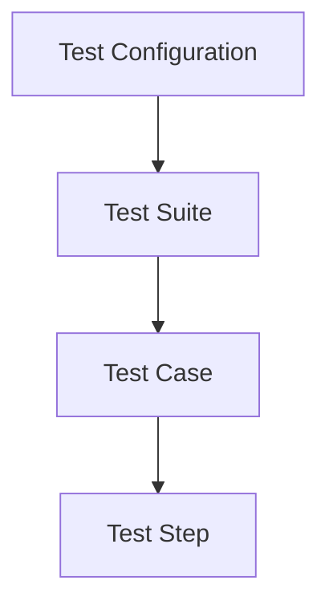

# MTA Test Case Placement & Lifecycle Guide
**📍 You are here:** `references/placement-and-lifecycle.md` | **🏠 Return to:** [MTA Core Skill](../SKILL.md)
*Metadata: Version 5.0 | Last Updated: 2026-09-02*

This reference guide establishes the principles, trade-offs, and rules for **Test Case Placement**, **MTA Entity Hierarchy**, **Setup/Teardown Data Management**, and **Data Piping Mechanics (Memory vs. Database)** using the consolidated 53-tool MTA-ACCP API (`/primitivetools/mcp`).

---

## 🏛️ MTA ENTITY HIERARCHY & BUSINESS RULES

MTA operates on a strict **4-layer structural framework**:



### 1. The 4 Layers
1.  **Test Configuration (highest level):** Describes *which* Test Suites and *which* Applications will be tested. It represents the global execution environment, credentials, and app instances.
2.  **Test Suite (second level):** An executable collection of logically related Test Cases. It serves as the primary boundary for execution flow, shared suite variables, and shared transaction sessions.
3.  **Test Case (third level):** A single test script designed to verify a specific business scenario or user flow. It consists of sequential test steps.
4.  **Test Step (lowest level):** The individual building blocks inside a test case. Steps represent atomic actions (creating an object, clicking a widget, calling a microflow, or executing an assertion).

### 2. Critical Business Rules
*   **Version Compatibility:** The Application Revision of the Test Suite **MUST** be equal to the Application Revision of the Test Configuration, targeting the exact same Application, in order to be executed.
*   **Step Sequencing:** Steps are executed in strict chronological order based on predecessor keys (`TestStepBeforeKey`).
*   **State Isolation:** Transactions and runtime memory are isolated at the Test Case boundary unless explicit data piping or database persistence is utilized.

---

## 🏢 TEST SUITE & CONTAINER ADMINISTRATION

### 1. Programmatic Suite Initialization Flow
To create and initialize a new test suite from scratch, follow this canonical 4-step sequence:
1.  **Create the Suite:** Call `CreateTestSuite(ApplicationKey, Name, Description)` ➔ Returns `TestSuiteKey`.
2.  **Configure Suite Metadata:** Call `EditTestSuite(TestSuiteKey, Name, Description, ExecutionCondition)`.
3.  **Resolve/Provision Execution User:**
    *   Call `GetExecutionUsers(ApplicationKey)` to discover available execution users.
    *   If a new user is required, call `CreateExecutionUser(ApplicationKey, Username, Password, Role)` ➔ Returns `ExecutionUserKey`. Symmetrically, call `EditExecutionUser(ExecutionUserKey, Username, Password, Role)` to update existing user credentials.
4.  **Provision the Test Case:** Call `CreateTestCase(TestSuiteKey, ExecutionUserKey, Name, Description, TestCaseBeforeKey=0, RollbackTcseAfterExecution, Timeout)` ➔ Returns `TestCaseKey`.

### 2. Programmatic Sequencing
*   **Test Suite Sequencing:** Call `SetSequenceOfTestSuite(TestSuiteKey, TestSuiteBeforeKey)`. Pass `0` for `TestSuiteBeforeKey` to place at the start.
*   **Test Case Sequencing:** Call `SetSequenceOfTestCase(TestCaseKey, TestCaseBeforeKey)`. Pass `0` for `TestCaseBeforeKey` to place at the start.

### 3. Application & Configuration Lookup Getters
*   **`GetApplicationDetails(ApplicationName, AppId)`**: Retrieves an application key, name, and registered configuration details.
*   **`GetTestConfigurationDetails(TestConfigurationKey)`**: Lists all test suites and metadata under the specified test configuration.

### 4. ⚡ Step-by-Step Interactive Placement Discovery Law (Token Conservation)
To prevent token bloat, resolve placement interactively:
1.  **Phase 1: Application Resolution & Test Configuration Scan**
    *   Call `GetApplicationDetails(ApplicationName)` to retrieve the `ApplicationKey` and configurations. Present choices to user and **HALT**.
2.  **Phase 2: Test Suite Scan & Selection**
    *   Call `GetTestConfigurationDetails(TestConfigurationKey)` to inspect available test suites. Present choices and **HALT**.
3.  **Phase 3: Test Case Scan & Selection**
    *   Call `GetTestSuiteDetails(TestSuiteKey)` to inspect test cases. Present choices and **HALT**.

---

## 🧬 TESTRUN SCOPES, REVISIONS & BRANCHING STRATEGY

### 1. Test Run Execution Scopes (`ExecuteTest`)
*   **Test Configuration Scope (`ExecutionScope="TestConfiguration"`):** Executes all Test Suites in the configuration.
*   **Test Suite Scope (`ExecutionScope="TestSuite"`):** Executes all Test Cases within a single Test Suite. Recommended for active test development.
*   **Test Case Scope (`ExecutionScope="TestCase"`):** Executes exactly one Test Case. Fastest isolated verification.

---

## 📅 DATA SETUP & TEARDOWN STRATEGY (TRADE-OFFS)

| Strategy | Implementation Pattern | Advantages | Disadvantages |
| :--- | :--- | :--- | :--- |
| **Option 0: In-Memory (Preferred for Backend)** | Create objects in memory (`CreateObjectActionTestStep(ObjectAction="CreateObject")`), link them, and pass directly to target microflow without calling Persist. | • Extreme speed.<br>• Zero database pollution.<br>• Perfect isolation. | • Only for backend tests without internal DB retrieves. |
| **Option A: In-Case (Self-Contained DB)** | Setup and Teardown are placed inside the same Test Case (Backend), or split across 3 cases (Frontend Setup, Execution UI, Teardown). Uses Persist to commit and Delete+Persist to clean up. | • Perfect transaction isolation.<br>• Highly portable test cases. | • Slower DB write/delete overhead. |
| **Option B: Dedicated Master Data Suite** | Dedicated setup and teardown test cases in a master data suite seed shared static records once. | • Seeds static data once.<br>• Domain model change resilience. | • Cross-suite test dependency. |

---

## 🔀 DATA PIPING MECHANICS (MEMORY VS. DATABASE)

```
[Test Case X] ─── (Memory Isolated) ───► [Test Case Y]
      │                                       ▲
      ▼ (Persist)                             │ (Retrieve)
[Mendix Database] ────────────────────────────┘
```

### 1. Piping Inside a Test Case (Via Memory)
Memory-based piping links the output of Step A directly to Step B inside the same Test Case using `TestStepOutputKey` or `SelectValueForValue` (`SetTestStepOutputForSelectValueForValue`).

### 2. Piping Between Test Cases (Via Database or Suite Variables)
*   **Pattern A: Database Persistence & Retrieve:** Commit with `Persist` in Case X, retrieve with `RetrieveObjects` in Case Y.
*   **Pattern B: Suite Variables:** Pass non-persisted scalar values across cases in the same suite run.
*   **Pattern C: Cross-Case Output Piping for Teardown Deletes:** Frontend Case 3 Teardown deletes directly target Case 1 Setup creation output keys without intermediate retrieves.

---

## 💾 TEST CASE METADATA PRESERVATION

### Saving the Approved Execution Plan (Gate 2 Approval)
Upon receiving explicit user approval for Gate 2 at the end of `STATE_BUILD_PLANNING`, save the approved Execution Plan locally before entering `STATE_CONSTRUCTION`:
*   **Agentic Track (Write-Enabled):**
    1. **Target File & Archiving / Deduplication Audit:**
       Check if `${MTA_OUTPUT_PATH}/execution-plans/EP_<TestCaseName>.md` (defaulting to `${workspaceFolder}/menditect-output/execution-plans/EP_<TestCaseName>.md`) already exists:
       - **Case A: Fresh Plan (No existing file):**
         - Set `revision: 1`
         - Set `supersedes_plan_id: null`
       - **Case B: Zero-Change Re-Run (Existing file unchanged):**
         - Compare the content of the newly generated markdown body with the existing file's body.
         - If identical: **Do NOT archive or duplicate**. Output:
           > `ℹ️ Notice: The approved execution plan is identical to the active plan on disk (Revision: <N>). Re-using existing Plan ID without archival.`
         - Proceed to `STATE_CONSTRUCTION` without creating archive noise.
       - **Case C: Modified Plan / Revision (Existing file with changes):**
         - Read the existing file's frontmatter to extract its `plan_id`, `approved_at`, and `revision`.
         - Format the archive timestamp as `YYYYMMDD_HHmmss` (e.g. `20260908_161141`).
         - Ensure `${MTA_OUTPUT_PATH}/execution-plans/archive/` exists.
         - Move the prior plan to:
           `${MTA_OUTPUT_PATH}/execution-plans/archive/EP_<TestCaseName>_<YYYYMMDD_HHmmss>.md`
         - In the new plan, set:
           - `supersedes_plan_id: "<old_plan_id>"`
           - `revision: <old_revision + 1>` (or `2` if previous had no revision)
    2. **Immutable Provenance Header (YAML Frontmatter):** Prepend a YAML frontmatter block to `EP_<TestCaseName>.md`:
       ```yaml
       ---
       plan_id: "urn:uuid:<UUIDv4>"
       schema_version: "1.0.0"
       supersedes_plan_id: "<urn:uuid:UUID | null>"
       revision: 1
       approved_at: "<ISO 8601 Timestamp, e.g. 2026-09-08T16:11:41+02:00>"
       test_case_name: "<TestCaseName>"
       target_configuration: "<TargetConfig>"
       target_suite: "<TargetSuite>"
       category: "<Backend | Frontend>"
       ---
       ```
    3. **Deterministic Integer Revision Sequence:** Revisions strictly increment monotonically (`revision: 1`, `revision: <old_revision + 1>`). If an existing plan is edited, increment the revision number, set `supersedes_plan_id` to the prior plan's UUID, and update `approved_at`.
    4. **Save File & Notify User (Sealed / Dual Receipt):** Write the plan to `${MTA_OUTPUT_PATH}/execution-plans/EP_<TestCaseName>.md`. Immediately notify the user with a clickable link and receipt:
       - *Fresh Creation (Revision 1):*
         ```markdown
         📄 **Execution Plan Stored & Sealed:**
         • **Plan ID:** `urn:uuid:<UUIDv4>` (Revision 1)
         • **File Location:** [`EP_<TestCaseName>.md`](file:///absolute/path/to/menditect-output/execution-plans/EP_<TestCaseName>.md)
         • **Relative Path:** `menditect-output/execution-plans/EP_<TestCaseName>.md`
         • **Approved At:** `<ISO 8601 Timestamp>`
         • **Status:** Approved (Gate 1 & Gate 2) & Sealed to Workspace
         ```
       - *Revision / Superseding Prior Plan:*
         ```markdown
         📄 **Execution Plan Stored & Sealed:**
         • **Plan ID:** `urn:uuid:<UUIDv4>` (Revision <N>)
         • **Supersedes:** `urn:uuid:<old_uuid>`
         • **Active Plan:** [`EP_<TestCaseName>.md`](file:///absolute/path/to/menditect-output/execution-plans/EP_<TestCaseName>.md)
         • **Archived Snapshot:** [`EP_<TestCaseName>_<timestamp>.md`](file:///absolute/path/to/menditect-output/execution-plans/archive/EP_<TestCaseName>_<timestamp>.md)
         • **Approved At:** `<ISO 8601 Timestamp>`
         • **Status:** Approved (Gate 1 & Gate 2) & Sealed to Workspace
         ```
    5. **State Persistence (`PAT-47`):** Record `execution_plan_file`, `execution_plan_id`, `execution_plan_approved_at`, `execution_plan_revision`, and `execution_plan_supersedes_id` in `mta_state.json`.
    6. **Pre-Construction Drift Detection (`STATE_CONSTRUCTION`):** When entering `STATE_CONSTRUCTION`, read the file, verify that `plan_id`, `revision`, and `approved_at` match the state tracker and frontmatter. If mismatch (drift detected), offer the **Soft Reconciliation Choice**:
       - *Option 1 (Accept Changes & Re-Sign):* Increments revision number, updates `approved_at` timestamp, updates `mta_state.json`, and proceeds.
       - *Option 2 (Halt & Revert):* Reject changes and restore the previously approved version before building.
    7. **Verification in Smoke Audit:** Read this local `.md` file to verify the plan and display Plan ID, Revision, Supersedes ID, and Approved At validity during `STATE_SMOKE_AUDIT`.
*   **Chat Track (Memory-Only / Write-Disabled):** If the environment lacks local file writing tools, warn the user (`> ⚠️ NOTICE: LOCAL STORAGE UNAVAILABLE...`), generate the UUID v4 and ISO 8601 timestamp, preserve the complete Execution Plan and metadata in the active chat context, set `ExecutionPlanFile: "chat-context"`, and continue the build process seamlessly.
