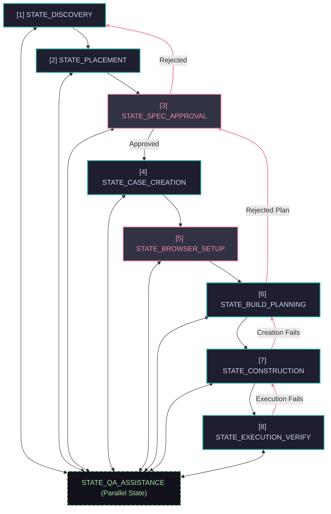

# MTA Unified Playbook: Core Rules & Checklist
**📍 You are here:** `references/core-playbook.md` | **🏠 Return to:** [MTA Core Skill](../SKILL.md)
*Metadata: Version 2.2 | Last Updated: 2026-06-30*

This playbook is the compacted, high-level workflow checklist and state transition master for MTA test construction. Exhaustive technical guidelines are delegated to targeted sub-manuals.

---

## 📅 WHEN TO LOAD THIS PLAYBOOK
*   **Always load at the start of ANY MTA-related request.**
*   Contains the core state machine, mandatory approval gates, and step-chaining laws.

---

## 🚥 STATE MACHINE TRANSITION MASTER

You MUST progress through these workflow states. Rollback/revision paths are supported to handle modifications or failures:

| State | Allowed Destination | Transition Trigger / Action | HALT Required? | Direction |
| :--- | :--- | :--- | :--- | :--- |
| **`STATE_DISCOVERY`** | `STATE_PLACEMENT` | User select direct path OR high-level scanning completes | No | Forward |
| **`STATE_PLACEMENT`** | `STATE_SPEC_APPROVAL` | Placement resolved & workflow mode selected | Yes (Guided only) | Forward |
| **`STATE_SPEC_APPROVAL`** | **`STATE_CASE_CREATION`** | User approves drafted specifications in chat | **YES (All Modes)** | Forward |
| **`STATE_SPEC_APPROVAL`** | `STATE_DISCOVERY` | User rejects specifications (requests different flow/app) | No | **Rollback** |
| **`STATE_CASE_CREATION`** | `STATE_BROWSER_SETUP` | Case key created & specs saved in system | No | Forward |
| **`STATE_BROWSER_SETUP`**| `STATE_BUILD_PLANNING` | Browser setup resolved and validated by user | **Yes (Guided Only)** | Forward |
| **`STATE_BUILD_PLANNING`**| `STATE_CONSTRUCTION` | Step build plan approved / defaults applied | Yes (Guided / Express-BP) | Forward |
| **`STATE_BUILD_PLANNING`**| `STATE_SPEC_APPROVAL` | User rejects build plan (requests structural revision) | **YES (All Modes)** | **Rollback** |
| **`STATE_CONSTRUCTION`** | `STATE_EXECUTION_VERIFY`| All steps constructed chronologically and bound | No | Forward |
| **`STATE_CONSTRUCTION`** | `STATE_BUILD_PLANNING` | Sequential creation tools fail (sequence/binding block) | Yes | **Rollback** |
| **`STATE_EXECUTION_VERIFY`**| `STATE_CONSTRUCTION` | Browser execution returns "failed" or "error" steps | No | **Rollback** |
| *Any State* | **`STATE_QA_ASSISTANCE`** | User asks tangent, conceptual question, or platform clarification | No | Out-of-Band |
| **`STATE_QA_ASSISTANCE`** | *Resumed State* | Tangent addressed; assistant **MUST HALT and ask for explicit user approval to resume** | **YES (Always)** | Resume |

### 📊 State Machine Flowchart



---

## 📋 THE 3-TEST CASE PATTERN FOR FRONTEND UI TESTS

All Category B (Frontend) tests **MUST** adhere strictly to this 3-Test Case architecture (never separate browser initialization from data setup/teardown):

```
1. CASE 1: SETUP (ExecutionCondition = "Always", ResumeExecutionAfterException = "_Continue")
   └─► Start Playwright (Local, Server, or Azure options) ➔ Returns Browser Context Output

2. CASE 2: EXECUTION (ExecutionCondition = "None", ResumeExecutionAfterException = "Stop")
   ├─► A. BACKEND SETUP / DATA SEEDING (Always, _Continue): Create objects & Persist once.
   ├─► B. UI EXECUTION & VERIFICATION (None, Stop): Starts frontend browser session, acts, asserts, and Stop_MxFrontendTest.
   └─► C. BACKEND TEARDOWN / CLEANUP (Always, _Continue): Delete seeded objects & Persist once.

3. CASE 3: TEARDOWN (ExecutionCondition = "Always", ResumeExecutionAfterException = "_Continue")
   └─► Teardown_Playwright ➔ Closes browser context safely
```

---

## 📋 COMPACTED STATE-BY-STATE OPERATIONAL CHECKLIST

### 1. `STATE_DISCOVERY` (State 1)
*   **First-Turn Tool Ban:** Run `GetMtaUrl` and present the interactive discovery template. Do NOT execute any other tools on a fresh turn.
*   **🚨 Handoff Category Validation (MANDATORY):** If you receive a handoff prompt from the Test Design skill or a custom user prompt, you **MUST** immediately check for a clear, explicit category selection (`Category A (Backend)` or `Category B (Frontend)`). If the prompt is generic, ambiguous, or lacks an explicit category, you **MUST NOT** proceed. You **MUST** halt in `STATE_DISCOVERY` and force the user to choose the category before starting any planning or suite scanning.
*   **Selection:** Lock the Test Category (Backend A vs Frontend B - **MANDATORY**) and Workflow Mode (Guided, Express-BP, Full Express).
*   **⚡ Concurrency Law (Scan Phase Parallelization):** Once discovery parameters are established, all read-only lookup and scanning tools (such as `GetPages`, `GetWidgets`, `GetTestSuites`, etc.) MUST be executed in parallel to minimize prompt roundtrips and accelerate discovery.
*   👉 **Read:** [MTA Placement & Lifecycle Guide](placement-and-lifecycle.md)

### 2. `STATE_PLACEMENT` (State 2)
*   **Placement:** Resolve environment (Configuration) and Suite. Use smart defaults in Express modes or prompt in Guided Mode.
*   👉 **Read:** [MTA Placement & Lifecycle Guide](placement-and-lifecycle.md)

### 3. `STATE_SPEC_APPROVAL` (State 3)
*   **Mandatory Halt:** Draft detailed specs for all 3 cases and **HALT for user approval** in all modes.
*   **🚨 Category Consistency Gate (MANDATORY):** You **MUST** run a strict consistency validation on your drafted specifications to ensure zero mixing of frontend and backend concerns.
    *   *If Category A (Backend) is locked:* Specifications and step descriptions are strictly prohibited from referencing pages, UI widgets, button clicks, browser navigation, or starting/stopping Playwright sessions.
    *   *If Category B (Frontend) is locked:* Specifications and step descriptions must focus on browser-level actions and UI assertions, restricting direct microflow calls exclusively to setup/teardown utility cases.
    *   *If any mixing is detected:* You **MUST** reject the specifications, explain the mismatch to the user, and rollback to `STATE_DISCOVERY`.
*   **Data Seeding Trigger:** If setup requires complex or multiple entities, proactively ask the user if they exist as static master data or should be created in-case.
*   👉 **Read:** [MTA Placement & Lifecycle Guide](placement-and-lifecycle.md) | [MTA Execution Settings Reference](execution-settings.md)

### 4. `STATE_CASE_CREATION` (State 4)
*   **🚨 Execution User Resolution (CRITICAL):** You **MUST** resolve the `ExecutionUserKey` before creating a test case, as it is a required parameter for `CreateTestCase`. Call `GetExecutionUsers` to verify if a user exists. If none are present (or a new user is needed), call `CreateExecutionUser` **first** to provision the user and obtain its key. You cannot create the test case first and register the user later.
*   **Creation & Save Specifications (MANDATORY):** Create test cases sequentially in forward chronological order passing the resolved `ExecutionUserKey`. Immediately after creation, you **MUST** call `SetTestCaseSpecifications` to save the complete approved specifications (Name, Objective, Preconditions, Expected Result) to the MTA server without any summarization.
*   **Settings:** Set execution options via `SetExecutionSettingsOfTestCase`.
*   👉 **Read:** [MTA Execution Settings Reference](execution-settings.md) | [MTA Placement & Lifecycle Guide](placement-and-lifecycle.md)

### 5. `STATE_BROWSER_SETUP` (State 5)
*   **Halt Gate:** In Guided Mode, offer Option A or Option B and **HALT** for validation. Auto-apply smart defaults in Express modes.
*   **Piping:** Link Case 1's returned `Browser` context output to Case 2's start step input.
*   👉 **Read:** [Playwright Browser Setup Manual](playwright-api.md#%F0%9F%8C%90-playwright-browser-setup-state-5)

### 6. `STATE_BUILD_PLANNING` (State 6)
*   **Halt Gate:** Present the detailed chronological step sequence build plan and **HALT** for user approval (Guided/Express-BP).
*   **Boilerplate Start/Stop Inclusion:** Ensure your build plan for Category B execution cases always places the startup and stop session steps at the boundaries, noting that they will be created first and configured with `"Always"` execution settings.
*   **Data Retrieve Trigger:** If the plan includes retrieve steps, ask the user if they rely on an active Master Data suite. Actively discourage retrieving any pre-existing database data (e.g., from database backups) as this destroys test portability across application instances. **If the user insists, propose using the MTA feature "Create Object By App Instance" (which allows creating objects based on existing objects in a connected app instance; warn them that this feature is not yet available as an MCP tool and must be set up manually in the MTA UI).** Ensure any valid dependency is documented in the case description.
*   **Verification Gate:** Explicitly present the choice between **Frontend Assertion** (verifying UI render/security) and **Backend Assertion** (database retrieve/assert). Highlight the maintenance tradeoffs.
*   **🚨 Deep Page Inspection Gate (MANDATORY for Frontend Category B):** You **MUST** explicitly ask the user whether they would like to run a **Deep Page Inspection** (to resolve input tab sequences, widget captions, and DatePicker formatting strings) before finalizing the build plan.
*   👉 **Read:** [MTA Frontend Testing Reference](frontend-testing.md) | [MTA Golden Rules Reference](golden-rules.md)

### 7. `STATE_CONSTRUCTION` (State 7)
*   **Save Build Plan (MANDATORY):** Immediately upon entering State 7, you **MUST** call `SetTestCaseSpecifications` to save the full approved chronological step-by-step build plan into the `Objective` or `Preconditions` field of the test case, ensuring it is permanently saved in the MTA server before constructing steps.
*   **🚨 "Start-and-Stop First" Boilerplate Rule (Category B):** Before constructing any standard UI actions/assertions inside a Category B (Frontend) execution test case, you **MUST** create the starting session step (e.g., `Start_MxFrontend_Test_With_Login` / `Start_MxFrontend_Test_Without_Login`) and stopping session step (`Stop_MxFrontendTest`) **first**, explicitly configuring both with `ExecutionCondition = "Always"` and `ResumeExecutionAfterException = "_Continue"`. Subsequent UI steps are then built and sequenced *between* them.
*   **Construction:** Construct steps chronologically forward. Follow the strict options protocol (Create Object ➔ Set Attributes ➔ Microflow).
*   **Piping:** Proactively pipe memory outputs using select binders to link step outputs to subsequent inputs.
*   **Smoke Audit:** Before transitioning to State 8, you **MUST** run the State-Exit checks. This includes programmatically querying the MTA server via `GetTestConstructionErrorsOfTestCase(TestCaseKey)` to fetch and resolve all compiler and validation errors, alongside manual verification of step name conformity, execution settings, browser piping, output piping, and ensuring that **every created data variation has an explicit Name and Description configured**.
*   👉 **Read:** [MTA Golden Rules Reference](golden-rules.md) | [MTA API Helpers Reference](api-helpers.md) | [MTA Data Variations Reference](data-variations.md)

### 8. `STATE_EXECUTION_VERIFY` (State 8)
*   **Execution:** Call `ExecuteTestSuite` (recommended) or `ExecuteTestCase` (isolated dry-run). Return Execution ID and **HALT**. Do NOT auto-poll.
*   👉 **Read:** [MTA Troubleshooting Guide](troubleshooting.md)

### `STATE_QA_ASSISTANCE` (Out-of-Band State)
*   **Inquiry:** Pauses active test building to address tangents, questions, or explanations.
*   **🚨 Resumption Halt Gate (MANDATORY):** Before transitioning back to resume the active building or execution state, the assistant **MUST HALT** and explicitly ask the user for approval to proceed (e.g., "Would you like to resume test building according to our approved plan?"). This ensures the user has a chance to ask further questions before test construction continues.
*   👉 **Read:** [MTA Glossary & Syntax Map](glossary.md)

---

## 📋 CANONICAL EXECUTION CONDITIONS & MATRIX

To ensure complete clarity, prevent compilation errors, and guarantee database cleanliness, all execution conditions, delay settings, rollback defaults, and cascading dependency laws are isolated in a dedicated manual.

### 🧭 High-Level Summary of Execution Rules:
*   **Boilerplate Cases:** Case 1 (Setup) and Case 3 (Teardown) are set to `"Always"` execution with `"_Continue"` exception handling.
*   **Boilerplate & Backend Steps:** Options object creation, browser startup steps, data seeding (Create, Persist), and data teardown (Delete, Persist) steps are set to `"Always"` execution and `"_Continue"` exception handling.
*   **Standard Steps:** Standard UI interactions and assertions are set to `"None"` execution and `"Stop"` exception handling.
*   **Rollback Defaults:** `RollbackTcseAfterExecution` is set to `"No"` by default for all test cases, except for Backend Unit Tests (consisting of a single microflow execution) where it is set to `"Yes"`.
*   **Cascading Laws:** Execution condition `"Always"` cascades backward to providers. Execution condition `"Skip"` cascades forward to consumers.

👉 **Read the complete manual here:** [MTA Execution Settings Manual](execution-settings.md)

---

## 🏆 MTA GOLDEN RULES & TEST DESIGN

To prevent sequence corruption, maintain clean naming, and build robust dynamic piping, all core test construction laws, variable piping patterns, and lifecycle cleanup best practices are isolated in a dedicated manual.

### 🧭 High-Level Summary of Golden Rules:
1.  **The Predecessor Chaining Law:** Elements (steps or cases) must be created in chronological forward order. Omit predecessors entirely for the absolute first element in an empty container; do NOT pass `0` or `null`. Concurrent/parallel step creation or sequence modifications are strictly banned.
2.  **Zero Data in Step Names:** Describe *what* the step does, not *which* data it uses. Use the template: `[Action] [WidgetType] '[FieldDescriptor]' [Input/Button]`.
3.  **Proactive Output Piping:** Always pipe outputs from preceding teststeps (locators, objects, primitive attributes) directly into subsequent steps to maximize dynamic test maintenance and avoid hardcoding values.
4.  **Modular Setup & Teardown Isolation:** Isolate data seeding and teardown actions in setup/teardown cases, keeping core test flows clean.
5.  **Test Case Session Boundaries:** Objects kept in memory can only be shared within the same test case. Passing objects across cases requires persisting them to the database.

👉 **Read the complete manual here:** [MTA Golden Rules & Test Design Manual](golden-rules.md)

---

## 🏃 CONCRETE END-TO-END EXAMPLE: "Create a login validation test"

1.  **`STATE_DISCOVERY`**: Agent HALTs, presents discovery template. User selects Scan Path. Agent scans suites and returns choices.
2.  **`STATE_PLACEMENT`**: User selects suite `UserManagement`. Agent defaults target case sequence to Position 1 and chooses *Express with Build Plan* mode.
3.  **`STATE_SPEC_APPROVAL`**: Agent drafts high-level specs for 3 cases (Setup, Validation, Teardown) and HALTs. User responds: *"Proceed"*.
4.  **`STATE_CASE_CREATION`**: Agent creates Case 1, 2, and 3 sequentially in forward order and saves specs.
5.  **`STATE_BROWSER_SETUP`**: Agent configures Playwright browser options with Login Redirect URL.
6.  **`STATE_BUILD_PLANNING`**: Agent drafts step build sequence plan (sequential steps) and HALTs. User responds: *"Looks good"*.
7.  **`STATE_CONSTRUCTION`**: Agent sequentially calls step creation and binding tools (attributing options before microflows).
8.  **`[STATE_EXECUTION_VERIFY]`**: Agent executes test run once, retrieves results, and reports final outcome to user.

---

## 🔍 THE 3-SECOND PRE-RESPONSE SELF-AUDIT (MANDATORY)

Before outputting your response or executing any tool call, mentally verify these seven questions to guarantee absolute compliance with the MTA skill:
1. **Did I announce the current state?** I MUST have `Active State: [STATE_NAME]` printed at the very start of my response.
2. **If halting, did I announce the destination?** If I am halting for input, I MUST have `Next Destination State: [NEXT_STATE_NAME]` printed at the top.
3. **Did I output my Chain of Thought block?** If I am calling any MTA MCP tool, I MUST have the `> 🧠 **Tool Execution Reasoning:**` block printed *immediately before* the tool call block.
4. **Did I let the user choose the category?** I MUST have obtained the explicit choice of Category A (Backend) vs Category B (Frontend) during discovery and not assumed it on my own.
5. **Did I strictly format my MTA direct links?** Check that links strictly conform to the singular, lowercase, `/p/`-inclusive structure (e.g. `[BaseUrl]/p/testcase/[Key]`) with zero pluralization or trailing paths.
6. **Did I run the Pre-Execution Smoke Audit?** Before completing `STATE_CONSTRUCTION`, I MUST run the compact checklist (verifying `Mendix_URL` is populated, setup/options/seeding steps` are set to `"Always"` and `"_Continue"`, browser page is piped, and no unbound parameters) AND execute `GetTestConstructionErrorsOfTestCase` on the server to programmatically verify that zero validation or compiler errors exist.
7. **Did I parallelize permitted tool executions?** I MUST execute all scan/design phase lookups (e.g., `GetPages` & `GetWidgets`) and independent write configurations (e.g., matrix variation setups) in parallel to avoid redundant turns.
