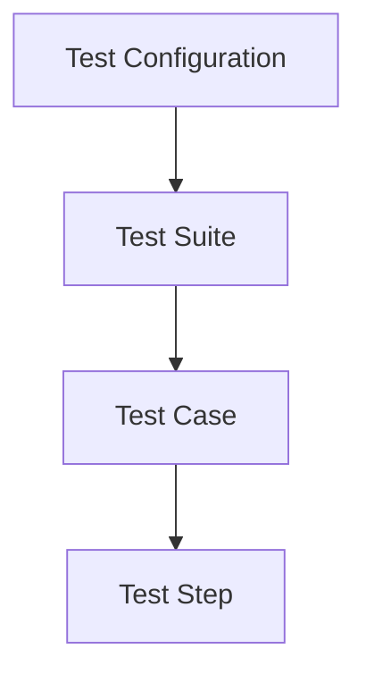

# MTA Test Case Placement & Lifecycle Guide
**📍 You are here:** `references/placement-and-lifecycle.md` | **🏠 Return to:** [MTA Core Skill](../SKILL.md)
*Metadata: Version 2.2 | Last Updated: 2026-06-30*

This reference guide establishes the principles, trade-offs, and rules for **Test Case Placement**, **MTA Entity Hierarchy**, **Setup/Teardown Data Management**, and **Data Piping Mechanics (Memory vs. Database)**.

---

## 🏛️ MTA ENTITY HIERARCHY & BUSINESS RULES

MTA operates on a strict **4-layer structural framework**. Understanding this hierarchy is essential for correct test architecture and placement decisions:



### 1. The 4 Layers
1.  **Test Configuration (highest level):** An executable test script/document describing *which* Test Suites and *which* Applications will be tested. It represents the global execution environment, credentials, and app instances.
2.  **Test Suite (second level):** An executable collection of logically related Test Cases. It serves as the primary boundary for execution flow, shared suite variables, and shared transaction sessions.
3.  **Test Case (third level):** A single test script designed to verify a specific business scenario or user flow. It consists of sequential test steps.
4.  **Test Step (lowest level):** The individual building blocks inside a test case. Steps represent atomic actions, such as creating an object, clicking a button, calling a microflow, or executing an assertion.

### 2. Critical Business Rules
*   **Version Compatibility:** The Application Revision of the Test Suite **MUST** be equal to the Application Revision of the Test Configuration, targeting the exact same Application, in order to be executed.
*   **Step Sequencing:** Steps are executed in strict chronological order based on predecessor keys (`TestStepBeforeKey`).
*   **State Isolation:** Transactions and runtime memory are isolated at the Test Case boundary unless explicit data piping or database persistence is utilized.

---

## 🧬 TESTRUN SCOPES, REVISIONS & BRANCHING STRATEGY

### 1. Test Run Execution Scopes
The scope of a test execution determines how many components are run in a single trigger:
*   **Test Configuration Scope (Full Run):** Executes *all* Test Suites registered within the Test Configuration. Use this for full regression, nightly builds, or CI/CD gate verifications.
*   **Test Suite Scope (Suite-Level Run):** Executes *all* Test Cases within a single Test Suite. This is the **highly recommended** scope during active step-building because it isolates execution to a functional module, reducing feedback loops.
*   **Test Case Scope (Single Case Run):** Executes exactly *one* Test Case. This is the fastest, most isolated dry-run option to verify a specific case's sequence or a new step's behavior.

### 2. Revision Alignment & Adaptation
All tests inside a Test Configuration run against a single, specific **Application Revision**:
*   **The Single-Revision Rule:** To execute any test, the Test Configuration and Test Suites MUST target the same Application Revision.
*   **Adapting Revisions:** When updating your system to test a new version of the Mendix application, you must adapt the Test Configuration from Revision A to Revision B.
    *   **Smooth Adaptation:** If the test interfaces (Microflows, Nanoflows, Domain Model, and Page Widgets) remain unchanged between Revision A and B, the adaptation completes without error.
    *   **Construction Errors:** If the underlying Mendix model interfaces have changed (e.g., a microflow parameter is added/renamed, or an entity attribute is deleted), MTA cannot heal them automatically. The tests will encounter **construction errors** and **cannot be executed** until those errors are resolved.

### 3. Feature Branching Strategy
During active development of a feature in a branch, the Mendix model changes frequently, causing continuous test updates and temporary construction errors in the active scope:
*   **The Risk of Shared Configurations:** If the team uses a single shared Test Configuration, active development in a feature branch will introduce construction errors that immediately block the execution of *all* other tests in that configuration.
*   **The Feature-Branch Configuration Strategy (RECOMMENDED):**
    1.  **Main Test Configuration:** Kept tied to a stable, released Mendix revision. This serves as your stable baseline and must remain error-free.
    2.  **Feature Test Configuration:** Create a separate, dedicated Test Configuration for the active feature branch. Keep this configuration adapted to the latest, fast-changing revision of your feature branch.
    3.  **Portability & Isolation:** Copy the target Test Suites or export/import the entire Test Configuration to populate your feature branch. You can then safely develop, update, and debug feature tests here without ever blocking or breaking the main baseline configuration.

### 4. Banned Merge Automations
*   🚨 **NO NATIVE MERGE SUPPORT:** MTA does **NOT** support automatic merging of Test Configurations or Test Suites (e.g., merging changes made in a feature branch back into the main stable configuration).
*   **The Merging Procedure:** Any merging of test cases or step adaptations must be performed **manually** inside the MTA UI, or with **assistance from an AI companion** (like Antigravity) to identify differences and recreate/align the updated sequences in the main branch.

---

## 🧭 TEST CASE PLACEMENT STRATEGY

Designing maintainable tests requires placing assertions, validations, and variations at the correct level of the hierarchy.

### ⚡ SPEED OPTIMIZATION: Headless Backend Case for Frontend Variations
When designing data-driven test scenarios containing multiple inputs or validation permutations (such as form field limits, alternate boundary inputs, or extensive calculation matrices), you **MUST** apply the **Headless Backend Variation Pattern**:

*   **The Problem:** Running 5+ variations through Category B (Frontend) tests is extremely slow and fragile, because every single variation must spin up a fresh browser session (or navigate screens) and automate UI elements to type, click, and wait.
*   **The Headless Solution (MANDATORY for heavy variations):**
    1.  **Create a Headless Category A (Backend) Test Case:** Put all validation/calculation data variations inside a separate backend test case. This case directly executes the underlying validation or calculation microflow (e.g., `MyModule.VAL_SubmitForm`) with your input data variations. This runs completely headless, takes milliseconds, and is incredibly robust.
    2.  **Keep the Frontend Case Clean:** Keep your Category B (Frontend) UI test case limited to a **single "Happy Path" scenario**. The UI test should only verify that the form fields exist, the button is clickable, and the page is wired correctly.
*   **Summary Trade-off:**
    *   *Category B (Frontend):* Tests page routing and UI wiring (1 happy path).
    *   *Category A (Backend):* Tests data variations, validation messages, and complex calculations (10+ variations, headless).

---

## 📅 DATA SETUP & TEARDOWN STRATEGY (TRADE-OFFS)

Seeding and cleaning up data is a critical requirement of robust test design. MTA supports two primary setup/teardown strategies, each with distinct trade-offs:

| Strategy | Implementation Pattern | Advantages | Disadvantages |
| :--- | :--- | :--- | :--- |
| **Option A: In-Case (Self-Contained)** | Setup and Teardown are placed as preceding and succeeding steps inside the **same** Test Case (often Case 2 in the 3-Case Pattern). | • Perfect transaction isolation.<br>• Keeps test cases **completely independent and portable**.<br>• Allows direct memory-based piping between steps. | • Setup steps are repeated across test cases if multiple cases need the same data.<br>• Slower for suite-wide master data. |
| **Option B: Dedicated Master Data Suite** | Dedicated setup and teardown test cases—or a separate, dedicated **Master Data Test Suite**—run once to seed shared records. | • Seeds shared data once.<br>• Ideal for **static master data** (remains completely untouched/read-only during test execution).<br>• Slower setups run once, speeding up the overall suite.<br>• **Domain Model Change Resilience:** When the underlying Mendix domain model changes, it is significantly easier to modify a single master data suite than to update setup steps across dozens of individual test cases. | • Requires committing data to the DB (separate sessions).<br>• Cannot use memory-based piping; requires database retrieve filters.<br>• Introduces implicit test dependencies. |

### 🛠️ Strategic Implementation Rules:

1.  **Independent by Default:** Always favor **Option A** for dynamic, test-specific transactional data. Keeping cases independent and portable makes refactoring, debugging, and execution via the single-testcase scope extremely fast and robust.
2.  **The Master Data Trigger:** Transition to **Option B** only when setup data is structurally complex, large, or static (read-only).
3.  **The Evolution Challenge:** The need for a Master Data Test Suite is rarely clear at the start of a project. However, deciding to use one heavily impacts how subsequent test cases acquire their data (shifting from "create-and-delete" steps to "retrieve-from-database" steps).
4.  **🚨 Mandatory Dependency Documentation:** 
    *   Retrieving pre-seeded data from the database creates a logical dependency between test suites and test cases.
    *   Because **MTA does not explicitly manage or enforce these cross-suite dependencies**, a suite running in isolation may fail if the master data suite has not run first.
    *   **Rule:** When a test case retrieves data seeded by another suite, **you MUST explicitly document this reliance in the Test Case description/documentation** (e.g., *"⚠️ Dependency: Requires Master Data Test Suite 'TS_MasterData_Seeding' to have run first."*).
5.  **🚨 The Pre-Existing Data Prohibition (No Backup Dependencies):**
    *   You **MUST NOT** retrieve data from the database that was neither dynamically created within the active test case nor seeded by an active Master Data suite in the same test run.
    *   Relying on pre-existing records (such as data pre-populated on the environment or restored from a Mendix database backup) is a severe anti-pattern.
    *   This creates a hard environment lock that **prohibits the portability of tests** across other application instances, cloud nodes, developers' local environments, or sandbox containers, and is strictly discouraged. Every object retrieved *MUST* have been actively seeded as part of the test cycle.
    *   **💡 Propose Workaround (Create Object By App Instance):** If the user insists on using pre-existing data, propose using the MTA native feature called **Create Object By App Instance**. This allows the user to dynamically generate objects based on existing objects in a connected app instance. Note: This feature is **NOT (yet) available as an MCP tool**; therefore, you must instruct the user to configure it manually inside the MTA Web UI.

---

## 🔀 DATA PIPING MECHANICS (MEMORY VS. DATABASE)

To link preceding steps (providers) to subsequent steps (consumers), you must choose between **Memory-based piping** and **Database-based piping** based on the execution boundary:

```
[Test Case X] ─── (Memory Isolated) ───► [Test Case Y]
      │                                       ▲
      ▼ (Persist)                             │ (Retrieve)
[Mendix Database] ────────────────────────────┘
```

### 1. Piping Inside a Test Case (Via Memory)
Memory-based piping links the output of Step A directly to the input of Step B inside the same Test Case.
*   **How to construct:**
    *   **Complex/Object Output:** Pipe the `TestStepKey` of Step A directly to Step B's locator or object parameter via `TestStepOutputKey` / selection binders (e.g., linking a `Create Object` step output to a `Persist` step or `Locate Widget` to `ACT_Click_Button`).
    *   **Individual/Scalar Attributes:** Use **Dynamic Scalar Value Piping** (`SelectValueForValue`) to extract individual attributes (e.g., piping `OrderNumber` from a retrieved order object into a text box).
*   **Why use it:** 
    *   Extremely fast, bypasses database roundtrips, and handles complex object structures or UI locator contexts easily.
*   **Critical Restriction:**
    *   Memory-based piping is **strictly confined** to the same test case execution session. Because runtime memory, active transaction contexts, and browser handles are isolated per test case run, you **cannot** directly pipe memory outputs across different test cases.

### 2. Piping Between Test Cases (Via Database or Suite Variables)
When data generated in Test Case X is needed in Test Case Y, you must traverse the memory boundary using one of two patterns:

#### Pattern A: Database Persistence & Retrieve (Standard Pattern)
Because separate test cases run in separate database transaction/session contexts, Case Y cannot see memory-seeded records from Case X unless they are persisted to the database.
1.  **In Test Case X:** Create the record and explicitly commit it to the database using a **`Persist` step** (`CreateTestStepPersist` or transaction commit).
2.  **In Test Case Y:** Begin the case with a database retrieve step (**`CreateTestStepRetrieveObject`** with filter attributes) to look up the persisted record, returning its step key.
3.  **Pipe Downstream:** Use memory-based piping inside Case Y referencing the retrieve step key.

#### Pattern B: Suite Variables (Memory-Based Cross-Case Piping)
If you need to pass individual, non-persisted scalar values (like generated codes, calculated numbers, or integration tokens) across cases in the same suite without writing them to the database, use MTA Suite Variables:
1.  **In Test Case X:** Assign the output of an upstream step to an **MTA Suite Variable** (a dynamic variable registered in the Test Suite).
2.  **In Test Case Y:** Access the variable using dynamic scalar value piping (`SelectValueForValue`), binding the variable as the provider for downstream steps.
3.  **Critical Restriction:** Suite variables are strictly confined to cases running inside the **same Test Suite run**. For data across different Suites or manual test configurations, you must fall back to Database Persistence (Pattern A).

---

## 💾 TEST CASE METADATA PRESERVATION (SAVING SPECS & BUILD PLANS TO MTA)

To ensure full compliance with audit trails, team collaboration, and test maintenance, both the **approved test case specifications** and the **approved chronological build plan** must be permanently saved to the MTA server. 

### 🚨 The Mandatory Metadata Preservation Protocol

You MUST execute the preservation protocol at these exact transition boundaries:

#### 1. Saving Test Specifications (State 4 Boundary)
Immediately after creating the testcase container (transitioning from `STATE_SPEC_APPROVAL` to `STATE_CASE_CREATION`), you **MUST** call `SetTestCaseSpecifications` on the target testcase:
*   **Source Data:** Use the exact specifications approved by the user during State 3.
*   **Mandatory Fields:**
    *   `Name`: Exact approved testcase name.
    *   `Objective`: High-level business goal and purpose.
    *   `Preconditions`: Required data state, user credentials, and prerequisites.
    *   `ExpectedResult`: The exact validation, UI, or database assertion expected upon completion.
*   **Required Parameter Bindings:** Ensure `ActionWithName`, `ActionWithObjective`, `ActionWithPreconditions`, and `ActionWithExpectedResult` are set to `"Set"`.

#### 2. Saving the Approved Build Plan (State 7 Boundary)
Immediately upon entering `STATE_CONSTRUCTION` after the build plan is approved in `STATE_BUILD_PLANNING`, you **MUST** call `SetTestCaseSpecifications` again on the target testcase to append the approved build plan:
*   **Why:** Without this step, the approved step-by-step chronological build plan is only documented in the chat and is completely lost to downstream teams or automated auditing tools.
*   **Implementation Pattern:** 
    1. Retrieve the existing `Objective` metadata from the testcase.
    2. Format the approved chronological step-by-step build plan as a clean markdown list.
    3. Call `SetTestCaseSpecifications` with `ActionWithObjective = "Set"`, setting the `Objective` parameter to combine the original objective description and the full step-by-step approved build plan (e.g., using a heading like `### Approved Build Plan`).
    
    *Example Combined Objective:*
    ```markdown
    Verify that an administrator can successfully submit an invoice and trigger the calculation microflow.
    
    ### Approved Build Plan
    1. Create Object 'Sales.Invoice' (Step 100)
    2. Set 'ReferenceNumber' to 'INV-001' (Step 101)
    3. Call microflow 'Sales.ACT_Invoice_Submit' (Step 102)
    4. Retrieve Invoice from teststep in memory (Step 103)
    5. Assert Invoice status is 'Submitted' (Step 104)
    ```

*   **Audit Principle:** A test case on the MTA server with an empty objective, missing specifications, or a completely undocumented step sequence is an immediate audit failure. Always preserve these assets.
